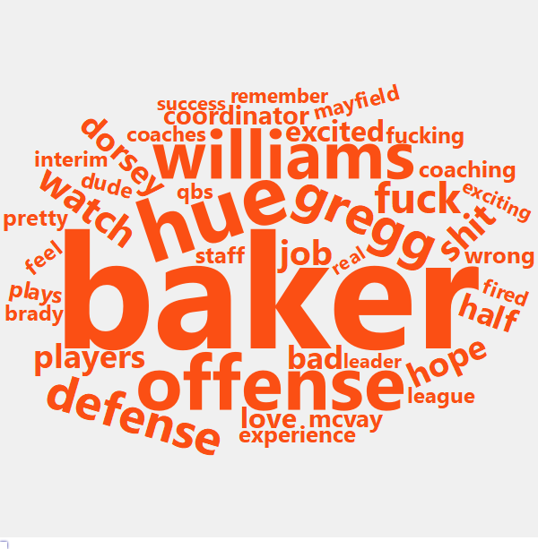
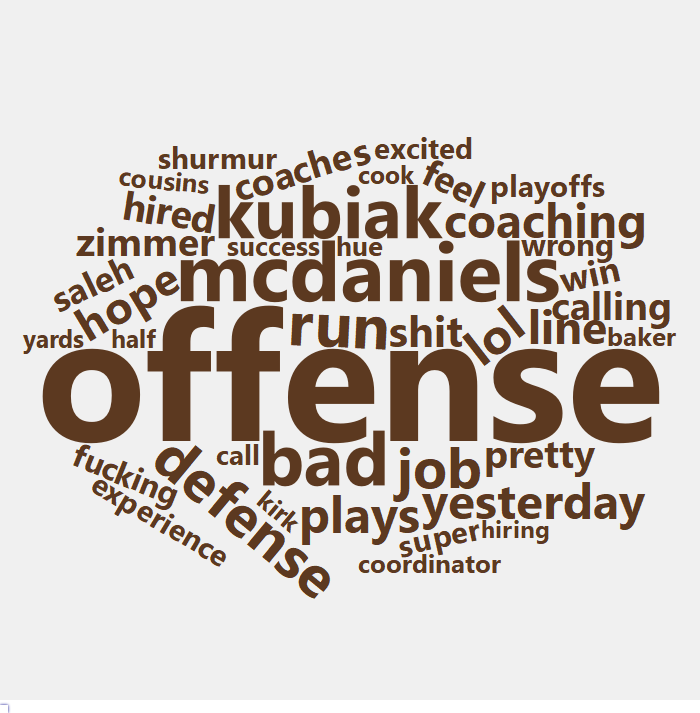

Hand up, this time last year I thought Freddie Kitchens was a good hire for the Cleveland Browns. The strong offensive finish to 2018 combined with Freddie’s seemingly close ties to Baker Mayfield had me convinced that Kitchens was the man for the job. I wasn’t about to let the fact that Freddie lacked any head coaching experience come between me and my delusions of Browns grandeur. I was hooked on recency bias, and it was a hell of a drug.

Fast forward to the present day. Freddie’s a goner, the Browns are once again riding the coaching carousel, and my hope-fueled dopamine high has long since faded. However, being so completely wrong left this armchair G.M.’s ego bruised and battered. I had to wonder if everyone bought into the hype or if I was among a gullible minority that fell for Freddie’s good ole boy schtick? To answer this question, I set out to measure the consensus fan opinion of the Kitchens pick and then compare it to that of Kevin Stefanski and other recent NFL head coach selections. 

## Data
I needed data to conduct this experiment, so I turned to Reddit threads – specifically posts on the NFL subreddit, r/nfl, and team-specific subreddits (i.e. r/browns for Kitchens and Stefanski, r/NYGiants for Joe Judge, etc.) linking to a Tweet or team release announcing a new hiring going back to 2018 (19 hires and 38 threads). 

Python was used to gather the comments from each thread along with the PRAW library which allows users to tap into Reddit's free API. See reddit_hire_data_pull.py and comments_data.csv in the repository for the code and data - https://github.com/ClayGirdner/nfl_hires_reddit_sentiment. 

In order to measure the overall sentiment for each thread, comments were fed through two different text analysis tools available in Python – [VADER](http://comp.social.gatech.edu/papers/icwsm14.vader.hutto.pdf) and [TextBlob](https://textblob.readthedocs.io/en/dev/), both of which produce numeric scores indicating the degree of polarity for each comment (i.e. level of positivity/negativity). Two example comments and their resulting scores are provided below along with a scatter plot displaying the relationship between the two polarity scores for all 31,000+ comments in the data set (correlation = 0.51).

(Note that all plots/calculations/analyses beyond this point will be done in R rather than Python.)

```{python sentiment, echo=FALSE, python.reticulate = FALSE}
import pandas as pd
from textblob import TextBlob
from vaderSentiment.vaderSentiment import SentimentIntensityAnalyzer

vader = SentimentIntensityAnalyzer()

comment_1 = 'I really like this hire for our team!'
comment_2 = 'This guy stinks! Why would we hire him?'

table = pd.DataFrame()

for comment in [comment_1, comment_2]:
    vader_polarity = vader.polarity_scores(comment)['compound']
    blob_polarity = TextBlob(comment).sentiment.polarity
    table = table.append({'Comment': comment, 'VADER': vader_polarity, 'TextBlob': blob_polarity}, ignore_index = True)
    
print(table)
```

```{r libraries_themes_data, include=FALSE}
library(nflscrapR)
library(tidyverse)
library(tidytext)
library(dplyr)
library(ggplot2)
library(ggimage)
library(ggrepel)
library(ggpubr)
library(stringr)
library(wordcloud2)
library(htmlwidgets)
library(webshot)

# Custom theme I built to mimic the PFF plotting theme
source("theme_pff.R")

# Load in comment data (originally gathered with a Python script)
comments <- read_csv("comments_data.csv")

# Import NFL logo URLs, sub Titans' for one with transparent background
nfl_logos <- read_csv("https://raw.githubusercontent.com/ClayGirdner/nfl_hires_reddit_sentiment/master/nfl_team_logos.csv")

comments <- comments %>%
    left_join(nfl_logos, by = c("team" = "team_code")) %>%
    left_join(nflteams, by = c("team" = "abbr"))
```

```{r vader_textblob_scatter, echo=FALSE}
vader_textblob_scatter <- comments %>%
    ggplot(aes(x = vader_compound, y = blob_polarity)) + 
    geom_point(alpha = 0.1) +
    geom_smooth(method = lm, size = 1.5) +
    labs(x = "VADER Polarity",
         y = "TextBlob Polarity") +
    theme_pff

vader_textblob_scatter
```

We see that the polarity metrics have a tendency to concentrate around zero as both methods default to zero if the polarity cannot be detected. If we exclude these neutral observations (polarity = 0 in either method), the correlation improves to 0.54. Due to this quirk in the data, neutral comments will be excluded when calculating the polarity aggregates for each thread in the subsequent section. However, note that these neutral comments **are** included in the subjectivity section presented later as they provide context on the overall intensity of emotion within comment threads.

## Polarity
With these polarity metrics in hand, scores were averaged for each hire thread on r/nfl since 2018. Results of these averaged polarity scores are presented below. 

```{r polarity_exclude, echo=FALSE}
# Polarity plot excluding neutral observations
polarity_plot_exclude <- comments %>%
    filter(subreddit == "nfl") %>%
    group_by(name, team, url.y, primary) %>%
    summarize(vader_polarity = mean(vader_compound[vader_compound != 0]),
              blob_polarity = mean(blob_polarity[blob_polarity != 0])) %>%
    ggplot(aes(x = vader_polarity, y = blob_polarity)) +
    geom_image(aes(image = url.y)) +
    geom_text_repel(aes(label = name,
                        color = primary),
                    point.padding = 0.5) +
    scale_color_identity() +
    labs(x = "Average VADER Polarity",
         y = "Average TextBlob Polarity",
         title = "Reddit Comment Polarity",
         subtitle = "r/nfl HC hiring threads since 2018",
         caption = "excludes neutral comments (polarity score = 0)") +
    theme_pff
polarity_plot_exclude
```

In the plot we see that Kitchens scored near the middle of the pack in terms of VADER and TextBlob polarity while Stefanski just trailed in both variables. Surprisingly enough, Steve Wilks, the one-year coach of Arizona in 2018 scored the highest in both metrics, while Adam Gase scored last and next-to-last (unsurprisingly enough). However, if we look at comment counts and subjectivity metrics (intensity of emotion, in either direction), Wilks’s high polarity scores begin to lose some of their luster and the Kitchens-Stefanski divide becomes more pronounced.

## Subjectivity and Comment Counts

```{r subjectivity_count, echo=FALSE}
# Function to lighten up colors by 10%
lighten <- function(color, factor = 0.1) {
    if ((factor > 1) | (factor < 0)) stop("factor needs to be within [0,1]")
    col <- col2rgb(color)
    col <- col + (255 - col)*factor
    col <- rgb(t(col), maxColorValue=255)
    col
}

# Scatter plot of both subjectivity scores
subjectivity_plot <- comments %>%
    filter(subreddit == "nfl") %>%
    group_by(name, team, url.y, primary) %>%
    summarize(vader_subjectivity = mean(abs(vader_compound)),
              blob_subjectivity = mean(blob_subjectivity)) %>%
    ggplot(aes(x = vader_subjectivity, y = blob_subjectivity)) +
    geom_image(aes(image = url.y)) +
    geom_text_repel(aes(label = name,
                        color = primary),
                    point.padding = 0.5) +
    scale_color_identity() +
    labs(x = "Average VADER Subjectivity",
         y = "Average TextBlob Subjectivity",
         title = "Comment Subjectivity") +
    theme_pff +
    theme(plot.title = element_text(hjust = 0.5))

# Total comments for each r/nfl thread
count_plot <- comments %>%
    filter(subreddit == "nfl") %>%
    group_by(name, team, url.y, primary) %>%
    summarize(count = sum(!is.na(name))) %>%
    ggplot(aes(y = count, x = reorder(name, count))) +
    geom_col(aes(fill = lighten(primary)),
             color = "black") +
    scale_fill_identity() +
    geom_image(aes(image = url.y,
                   y = count + 175),
               size = 0.058) +
    geom_text(aes(label = name, 
                  color = primary,
                  y = count + 350),
              hjust = 0) +
    scale_color_identity() +
    ylim(0, 3750) + 
    coord_flip() +
    labs(x = NULL, 
         y = NULL,
         title = "Comment Count",
         caption = "r/nfl comment threads since 2018") +
    theme_pff +
    theme(panel.grid.major.y = element_blank(),
          axis.text.y = element_blank(),
          plot.title = element_text(hjust = 0.5))

# Combining subjectivity and count plots side by side
subjectivity_count_plot <- ggarrange(subjectivity_plot, count_plot,
                                   ncol = 2, nrow = 1)
subjectivity_count_plot
```

The Wilks thread was the smallest in terms of total comments (116) and one of the least subjective threads (at least according to TextBlob). I interpret this to mean that fans did not feel strongly about the hire and that his high polarity scores could be fluky due to the small sample size. 

We also see that the Stefanski r/nfl hire thread was among the most opinionated discussions in the entire experiment and well ahead of the Kitchens thread which scored low in both subjectivity metrics. This suggests that fans are much more divided and emotional when it comes to Stefanski with only 23% of the Stefanski comments being neutral (according to VADER) compared to 34% of comments in the Kitchens thread. 

## Subreddit Comparisons
In addition to r/nfl, I also examined the hire threads within each team’s respective subreddit to compare the sentiment of team-specific fans to the general NFL fanbase within r/nfl. Here I compare VADER polarity scores between the two subreddit groups.

```{r subreddits, echo=FALSE}
comments_subs <- comments %>%
    group_by(name, team, subreddit, url.y, primary) %>%
    summarize(vader_polarity = mean(vader_compound[vader_compound != 0]))

subreddit_plot <- comments_subs %>%
    ggplot(aes(x = vader_polarity,
               group = name,
               y = reorder(name, vader_polarity))) +
    geom_line(aes(color = primary),
              size = 1) +
    scale_color_identity() +
    geom_image(data = filter(comments_subs, subreddit == "nfl"),
               size = 0.045,
               image = "https://upload.wikimedia.org/wikipedia/en/thumb/a/a2/National_Football_League_logo.svg/1200px-National_Football_League_logo.svg.png") +
    geom_image(data = filter(comments_subs, subreddit == "team"),
               aes(image = url.y),
               size = 0.06) +
    labs(x = "Average VADER Polarity", 
         y = NULL,
         title = "VADER Polarity Comparison",
         subtitle = "r/nfl vs team subreddits") +
    theme_pff +
    theme(panel.grid.major.y = element_blank(),
          axis.text.y = element_text(size = 13))

subreddit_plot
```

As intuition would suggest, this analysis shows that team subreddits tend to be more optimistic about “their guy” than the generalists commenting on r/nfl. This is especially true regarding the r/browns thread for Kitchens which had a VADER polarity score well above its r/nfl counterpart, proving that I wasn’t the only Browns fan drinking the Kool-Aid. However, the same cannot be said for the Stefanski thread on r/browns with an average polarity nearly equal to r/nfl, suggesting that Browns fans are returning to their usual pessimistic demeanor. The last point to note from this plot is the r/nyjets reaction to the Adam Gase selection. Jets fans were not only more pessimistic than the community at large, but they generated the lowest VADER polarity score by a sizable margin. (Note that r/eagles was not represented in this analysis.)

## Word Composition: Kitchens vs Stefanski
Lastly, I broke out the Kitchens and Stefanski discussions in order to compare the word composition between the two sets of comments. Below are wordclouds showing some of the most frequently used words from the Kitchens (orange) and Stefanski (brown) threads.





The word “baker” clearly sticks out when viewing the comment threads this way as it was heavily featured in the Kitchens discussion but barely mentioned in the Stefanski thread. In fact, Baker was mentioned nearly seven times more often when Freddie was hired! On the flip side, the word offense (or offensive) was mentioned more than twice as often in the Stefanski thread. I believe this is consistent with the narratives that Freddie was hired primarily due to his relationship with Mayfield and the other Browns players (word “players” 1.5x more often for Freddie) while Stefanski was hired for his ability to scheme up an offense and call plays.

## Conclusion
In summary, this analysis shows that my affection for Kitchens wasn’t completely outside the norm at the time of his hiring. However, it must also be noted that much of the Freddie love was concentrated within the Browns fanbase as Freddie’s polarity scores were roughly average within the r/nfl thread but sky high in the r/browns comments, supporting the idea that team subreddits are often echo-chambers. Who knows, perhaps this just goes to show that the consensus on Reddit may not be the most reliable predictor of future success (shocker, I know). And if that’s the case, it may be a good thing that the dummies on Reddit are talking negatively about my boy Stefanski! Oh boy, here I go getting my hopes up again…
